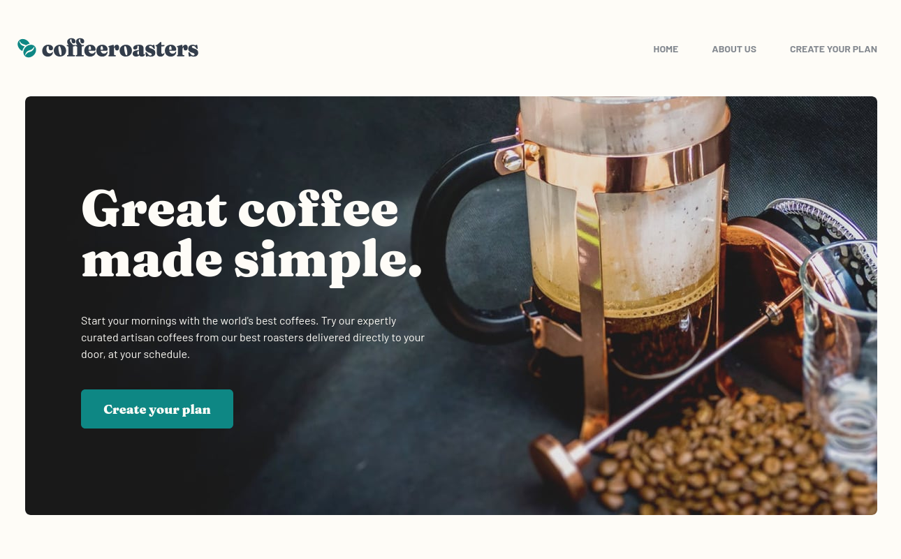
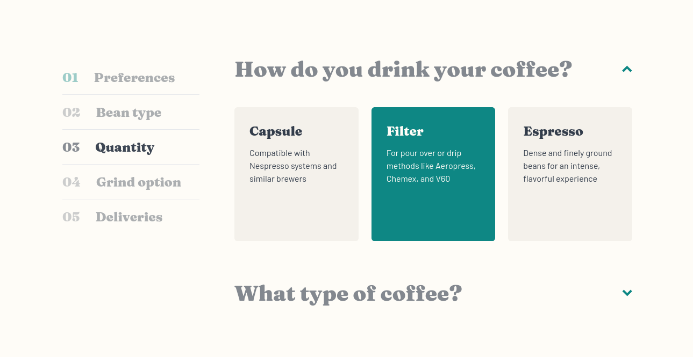
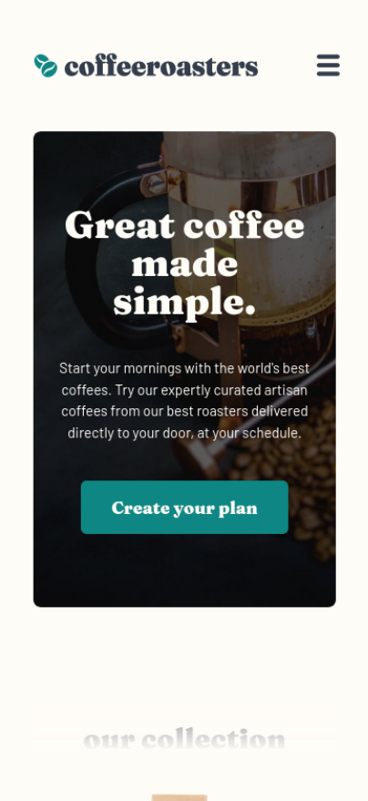
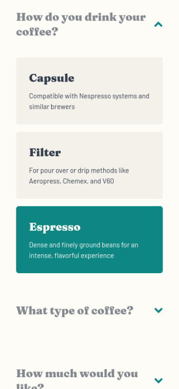

# Coffeeroasters subscription site

This project is a self built solution to the [Coffeeroasters subscription site challenge on Frontend Mentor](https://www.frontendmentor.io/challenges/coffeeroasters-subscription-site-5Fc26HVY6).

## Table of contents

- [Overview](#overview)
  - [The challenge](#the-challenge)
  - [Screenshot](#screenshot)
  - [Links](#links)
- [My process](#my-process)
  - [Built with](#built-with)
  - [Other libraries](#other-libraries)

## Overview

### The challenge

Users should be able to:
  - View the optimal layout for the interface depending on their device's screen size
  - Navigate smoothly between the different pages
  - Make selections to create a coffee subscription
  - See a order summary modal of their selections on the final step and confirm their plan choices
  - See data on console after submission

### Screenshot

Desktop view:

Mobile view:

### Links

- Live Site URL: [Cofeeroasters](https://coffeeroasters-subscription-henna.vercel.app/)

## My process

### Built with

- [Vue.js](https://vuejs.org/) - JS framework
- [Vue Router](https://router.vuejs.org/) - Routing for Vue
- [Vite](https://vitejs.dev/) - Frontend build tool
- [Tailwind Css](https://tailwindcss.com/) - Css framework

### Other libraries

- [VueUse](https://vueuse.org/) - Composition utilities